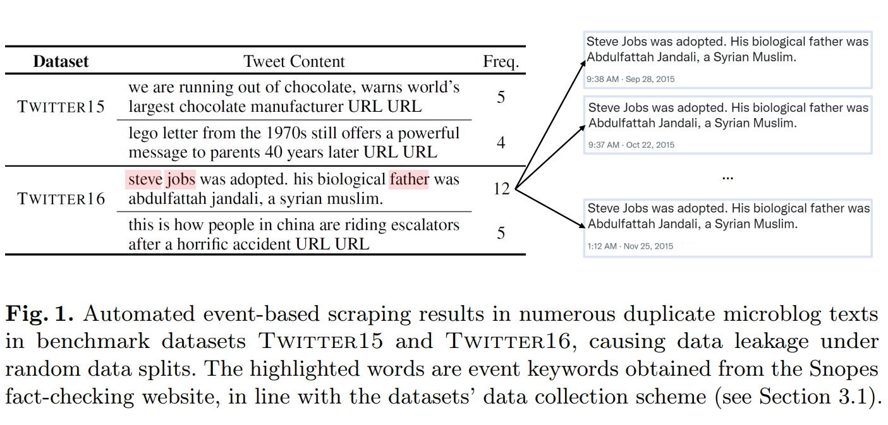

# Data and Code for "Probing Spurious Correlations in Popular Event-Based Rumor Detection Benchmarks"

This repo contains the data and code for the following paper: 

Jiaying Wu, Bryan Hooi. Probing Spurious Correlations in Popular Event-Based Rumor Detection Benchmarks, European Conference on Machine Learning and Principles and Practice of Knowledge Discovery in Databases (ECML-PKDD) 2022. [](https://arxiv.org/abs/2209.08799)


## Datasets: Twitter15, Twitter16, PHEME-veracity

The datasets used in the experiments are based on the three publicly available datasets, namely Twitter15 and Twitter16 released by [Ma et al. (2017)](https://aclanthology.org/P17-1066/), and PHEME-veracity released by [Kochkina et al. (2018)](https://aclanthology.org/C18-1288/).


The raw data for Twitter15 and Twitter16 can be downloaded from https://www.dropbox.com/s/7ewzdrbelpmrnxu/rumdetect2017.zip?dl=0, and PHEME-veracity can be downloaded from https://figshare.com/articles/dataset/PHEME_dataset_for_Rumour_Detection_and_Veracity_Classification/6392078.

In the `/data` folder, we provide the pre-processed data used for our experiments. The original Tweets (source posts) are provided in `data/[dataset_name]/[dataset_name].txt`, where each line contains the Publisher User ID, Tweet ID, and Tweet content, respectively. As Twitter15 and Twitter16 both consist of class-balanced tweets with abundant interactions, we also sample class-balanced tweets involving at least 10 users in PHEME-veracity (termed pheme_veracity_t10 in our code) for a fair comparison.


The data files titled `data/[dataset_name]/data.TD_RvNN.vol_5000.txt` are in a tab-separated column format (in line with the pre-processing of [BiGCN](https://github.com/TianBian95/BiGCN) and [RvNN](https://github.com/majingCUHK/Rumor_RvNN) for Twitter15 and Twitter16), where each line corresponds to a source post or user comment. We pre-process PHEME-veracity in the same manner.

Each line includes the following information:

```
1: root-id -- the tweet id of the source post;
2: index-of-parent-tweet -- parent index number for the current comment in the tweet propagation tree;
3: index-of-the-current-tweet -- index number for the current comment in the tweet propagation tree;
4: parent-number -- total number of parent nodes in the current tweet propagation tree;
5: text-length -- the maximum length of all the texts in the current tweet propagation tree;
6: list-of-index-and-counts -- space separated word index-count pairs, where each index-count pair is in the form of "index:count".
```

## Event-Separated Rumor Detection Task

### Why Event-Separated?
Benchmark datasets commonly adopt an **event-based** data collection framework. Firstly, a set of newsworthy events is identified. Then, relevant microblogs are retrieved in an automated manner (often via event keyword search). On this basis, Twitter15 and Twitter16 datasets performs event-level labeling, i.e., they conduct fact-checking at event level, and then assign all the source posts under an event with the same event-level fact-checking label. 

Therefore, under each event, the automated keyword-based microblog retrieval framework collects a large number of highly similar keyword-sharing samples with the same label, even obtaining **identical microblog texts** (see the figure below). Under random data splitting, where the event tags are overlooked, these duplicate texts scatter into the training and test data, creating severe data leakage.




For more discussion on the sources of spurious correlations in rumor detection benchmark datasets, please refer to Section 3 of our paper.

### Event-Separated Data Splits

To eliminate the impact of event-specific spurious correlations, we study a more practical **event-separated rumor detection** task (i.e. training and testing on disjoint sets of events). This task is challenging due to the underlying event distribution shift, and it thereby provides a means to evaluate debiased rumor detection performance. 

We split the datasets based on the publicly available event IDs released by [Ma et al. (2017)](https://github.com/majingCUHK/Rumor_RvNN/tree/master/resource) in the second column of `[dataset_name]_label_All.txt` and the event tags provided in the PHEME-veracity raw data. 

We publicly release our event-separated data splits at `data/[dataset_name]/[dataset_name]_eventsep.*`.


## Code for Publisher Style Aggregation (PSA) 

### Dependencies

We implement our proposed Publisher Style Aggregation (PSA) method based on PyTorch 1.6.0 with CUDA 10.2, and train the model on a single NVIDIA RTX 2080Ti GPU.

Main dependencies include:

```
python==3.7.9
numpy==1.19.5
torch==1.6.0
torch-geometric==1.6.3
torch-cluster==1.5.9
torch-scatter==2.0.6
torch-sparse==0.6.9
torch-spline-conv==1.2.1
tqdm==4.56.0
jsonlines==2.0.0
joblib==1.0.0
```

A complete list of all our installed packages and their corresponding versions can be found in `requirements.txt`.

### Data Preprocessing 

We provide pre-processed data files under `data/[dataset_name]_graph/`. These data files are obtained via:

```bash
sh preprocess.sh
```

For our proposed Publisher Style Aggregation (PSA) method, we collect each tweet publisher's posting records to learn publisher style features. These records are obtained by a look-up function with each publisher's user ID, which is publicly available in the first column of `data/[dataset_name]/[dataset_name].txt`. Note that only accessible data are used for training; i.e., we collect separate sets of publisher posting records based on the training and test data. We adopt the word2vec embeddings from [Yuan et al. (2020)](https://github.com/chunyuanY/FakeNewsDetection), which can be downloaded from https://drive.google.com/drive/folders/1IMOJCyolpYtoflEqQsj3jn5BYnaRhsiY?usp=sharing.

We utilize the [BiGCN](https://github.com/TianBian95/BiGCN) backbone for pre-processing the tweet propagations and for data loading.

### Training

We find that PSA significantly enhances the base classifiers MeanText and RootText, and report that best performance is achieved via MeanText + PSA (Sum) for Twitter15 and Twitter16, and via RootText + PSA (Mean) for PHEME-veracity. Different labeling schemes may account for such differences; as PHEME labels each microblog independently, the source posts would contain the most distinctive features. While the source post content is not as distinctive in Twitter15&16, both datasets exhibit more complicated propagation patterns. Therefore, adopting MeanText to aggregate comment features proves more effective in these cases.

The source code is provided in `model/psa_meantext_sum.py` and `model/psa_roottext_mean.py`, respectively. 

Start training with the following command:

```bash
sh model/run_psa.sh
```

The experiment logs are saved under `logs/`, and the resulting models are saved under `checkpoint/`.


## Citation

If you find this repo or our work useful for your research, please consider citing our paper

```
@inproceedings{wu2022probing,
  author       = {Jiaying Wu and
                  Bryan Hooi},
  title        = {Probing Spurious Correlations in Popular Event-Based Rumor Detection Benchmarks},
  booktitle    = {Machine Learning and Knowledge Discovery in Databases - European Conference,
                  {ECML} {PKDD} 2022, Grenoble, France, September 19-23, 2022, Proceedings,
                  Part {II}},
  pages        = {274--290},
  publisher    = {Springer},
  year         = {2022}
}
```
